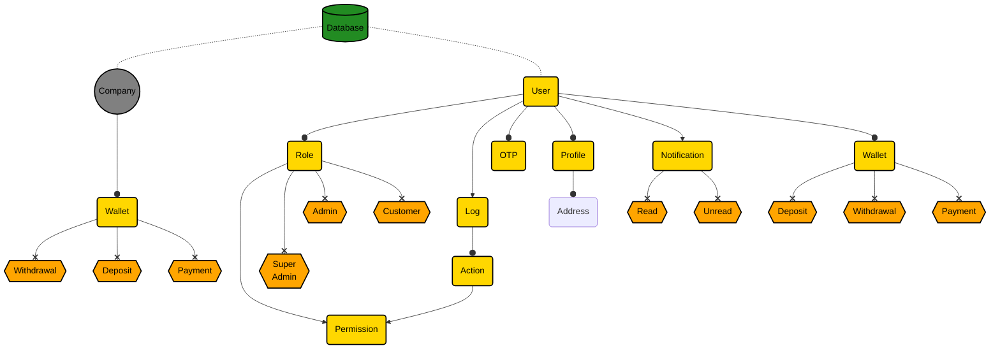
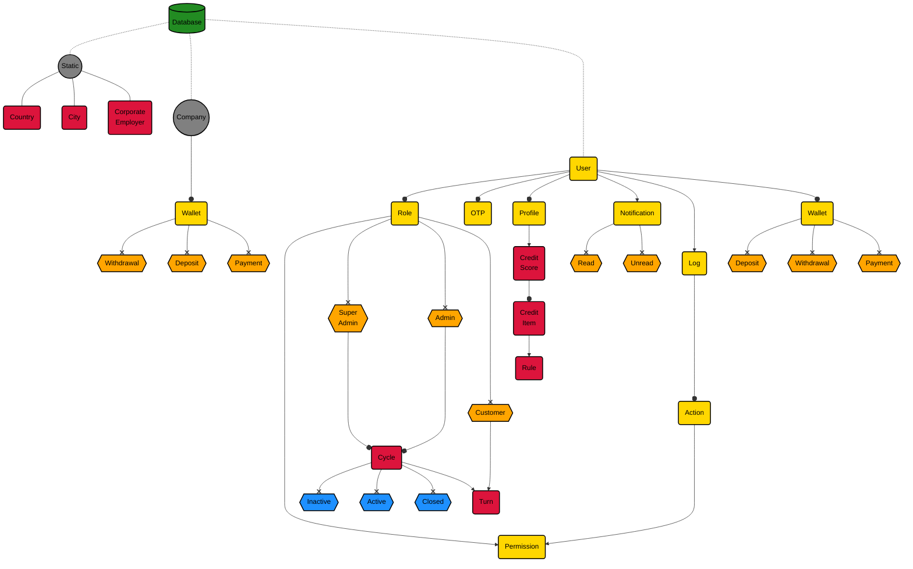
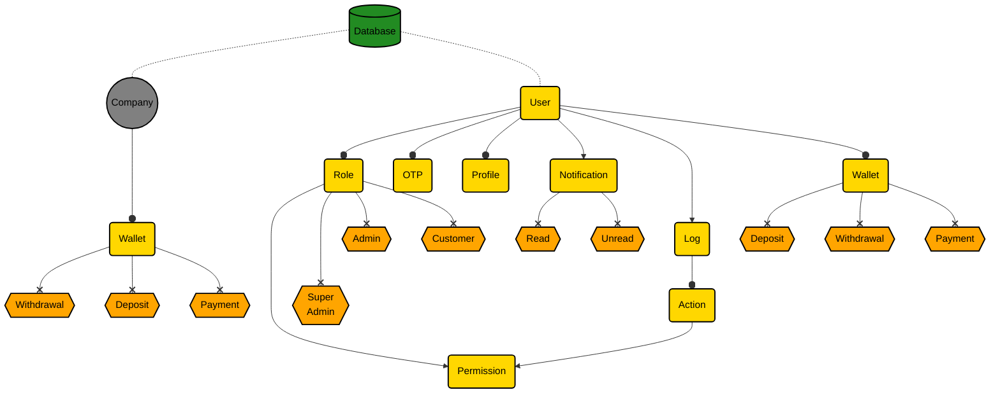

# Standard Database

```mermaid
flowchart TD
    style Database fill:forestgreen,stroke:black,stroke-width:2px,color:black;
    style Company fill:gray,stroke:black,stroke-width:2px,color:black;
    style User fill:gold,stroke:black,stroke-width:2px,color:black;
    style BankWallet fill:gold,stroke:black,stroke-width:2px,color:black;
    style Wallet fill:gold,stroke:black,stroke-width:2px,color:black;
    style Profile fill:gold,stroke:black,stroke-width:2px,color:black;
    style Role fill:gold,stroke:black,stroke-width:2px,color:black;
    style Deposit fill:orange,stroke:black,stroke-width:2px,color:black;
    style Withdraw fill:orange,stroke:black,stroke-width:2px,color:black;
    style Payment fill:orange,stroke:black,stroke-width:2px,color:black;
    style Deposit1 fill:orange,stroke:black,stroke-width:2px,color:black;
    style Withdraw1 fill:orange,stroke:black,stroke-width:2px,color:black;
    style Payment1 fill:orange,stroke:black,stroke-width:2px,color:black;
    style Action fill:gold,stroke:black,stroke-width:2px,color:black;
    style Permission fill:gold,stroke:black,stroke-width:2px,color:black;
    style SuperAdmin fill:orange,stroke:black,stroke-width:2px,color:black;
    style Admin fill:orange,stroke:black,stroke-width:2px,color:black;
    style Customer fill:orange,stroke:black,stroke-width:2px,color:black;
    style Customer fill:orange,stroke:black,stroke-width:2px,color:black;
    style Notification fill:gold,stroke:black,stroke-width:2px,color:black;
    style Log fill:gold,stroke:black,stroke-width:2px,color:black;
    style Otp fill:gold,stroke:black,stroke-width:2px,color:black;
    style Read fill:orange,stroke:black,stroke-width:2px,color:black;
    style UnRead fill:orange,stroke:black,stroke-width:2px,color:black;

    Database[("Database")] -.- Company
    Database -.- User

    Company(("Company")) ---o BankWallet("Wallet")
    BankWallet --x Withdraw{{"Withdrawal"}}
    BankWallet --x Deposit{{"Deposit"}}
    BankWallet --x Payment{{"Payment"}}

    User("User") --o Role("Role")
    User --> Log("Log")
    Role ----> Permission("Permission")
    Action("Action") --> Permission
    User --o Otp("OTP")
    User --o Profile("Profile")
    Profile --o Address("Address")
    User --> Notification("Notification")
    Notification --x Read{{"Read"}}
    Notification --x UnRead{{"Unread"}}
    Log --o Action
    User --o Wallet("Wallet")
    Wallet --x Deposit1{{"Deposit"}}
    Wallet --x Withdraw1{{"Withdrawal"}}
    Wallet --x Payment1{{"Payment"}}
    Role ---x SuperAdmin{{"Super\nAdmin"}}
    Role --x Admin{{"Admin"}}
    Role --x Customer{{"Customer"}}
```

# Gam3ia Database

```mermaid
flowchart TD
    style Database fill:forestgreen,stroke:black,stroke-width:2px,color:black;
    style Static fill:gray,stroke:black,stroke-width:2px,color:black;
    style Country fill:crimson,stroke:black,stroke-width:2px,color:black;
    style City fill:crimson,stroke:black,stroke-width:2px,color:black;
    style Corporate fill:crimson,stroke:black,stroke-width:2px,color:black;
    style Company fill:gray,stroke:black,stroke-width:2px,color:black;
    style CreditItem fill:crimson,stroke:black,stroke-width:2px,color:black;
    style Rule fill:crimson,stroke:black,stroke-width:2px,color:black;
    style User fill:gold,stroke:black,stroke-width:2px,color:black;
    style BankWallet fill:gold,stroke:black,stroke-width:2px,color:black;
    style Wallet fill:gold,stroke:black,stroke-width:2px,color:black;
    style Profile fill:gold,stroke:black,stroke-width:2px,color:black;
    style Role fill:gold,stroke:black,stroke-width:2px,color:black;
    style Deposit fill:orange,stroke:black,stroke-width:2px,color:black;
    style Withdraw fill:orange,stroke:black,stroke-width:2px,color:black;
    style Payment fill:orange,stroke:black,stroke-width:2px,color:black;
    style Deposit1 fill:orange,stroke:black,stroke-width:2px,color:black;
    style Withdraw1 fill:orange,stroke:black,stroke-width:2px,color:black;
    style Payment1 fill:orange,stroke:black,stroke-width:2px,color:black;
    style Cycle fill:crimson,stroke:black,stroke-width:2px,color:black;
    style Turn fill:crimson,stroke:black,stroke-width:2px,color:black;
    style Action fill:gold,stroke:black,stroke-width:2px,color:black;
    style Permission fill:gold,stroke:black,stroke-width:2px,color:black;
    style SuperAdmin fill:orange,stroke:black,stroke-width:2px,color:black;
    style Admin fill:orange,stroke:black,stroke-width:2px,color:black;
    style Customer fill:orange,stroke:black,stroke-width:2px,color:black;
    style CreditScore fill:crimson,stroke:black,stroke-width:2px,color:black;
    style Customer fill:orange,stroke:black,stroke-width:2px,color:black;
    style Notification fill:gold,stroke:black,stroke-width:2px,color:black;
    style Log fill:gold,stroke:black,stroke-width:2px,color:black;
    style Otp fill:gold,stroke:black,stroke-width:2px,color:black;
    style InActive fill:dodgerblue,stroke:black,stroke-width:2px,color:black;
    style Active fill:dodgerblue,stroke:black,stroke-width:2px,color:black;
    style Closed fill:dodgerblue,stroke:black,stroke-width:2px,color:black;
    style Read fill:orange,stroke:black,stroke-width:2px,color:black;
    style UnRead fill:orange,stroke:black,stroke-width:2px,color:black;

    Database[("Database")] -.- Static
    Database -..- Company
    Database -...- User
    Static(("Static")) --- Country("Country")
    Static --- City("City")
    Static --- Corporate("Corporate\nEmployer")

    Company(("Company")) ---o BankWallet("Wallet")
    BankWallet --x Withdraw{{"Withdrawal"}}
    BankWallet --x Deposit{{"Deposit"}}
    BankWallet --x Payment{{"Payment"}}

    User("User") --o Role("Role")
    User --o Otp("OTP")
    Role -----> Permission("Permission")
    Action("Action") ----> Permission
    User --o Profile("Profile")
    User --> Notification("Notification")
    Notification --x Read{{"Read"}}
    Notification --x UnRead{{"Unread"}}
    User ---> Log("Log")
    Log ----o Action
    Profile --> CreditScore("Credit\nScore")
    CreditScore --o CreditItem("Credit\nItem")
    CreditItem --> Rule("Rule")
    User --o Wallet("Wallet")
    Wallet --x Deposit1{{"Deposit"}}
    Wallet --x Withdraw1{{"Withdrawal"}}
    Wallet --x Payment1{{"Payment"}}
    Role ---x SuperAdmin{{"Super\nAdmin"}}
    Role --x Admin{{"Admin"}}
    Role ----x Customer{{"Customer"}}
    Cycle --x InActive{{"Inactive"}}
    Cycle --x Active{{"Active"}}
    Cycle --x Closed{{"Closed"}}
    SuperAdmin ----o Cycle
    Admin ----o Cycle
    Customer ---> Turn
    Cycle("Cycle") --> Turn("Turn")
```

# Aiwa Database

```mermaid
flowchart TD
    style Database fill:forestgreen,stroke:black,stroke-width:2px,color:black;
    style Company fill:gray,stroke:black,stroke-width:2px,color:black;
    style User fill:gold,stroke:black,stroke-width:2px,color:black;
    style BankWallet fill:gold,stroke:black,stroke-width:2px,color:black;
    style Wallet fill:gold,stroke:black,stroke-width:2px,color:black;
    style Profile fill:gold,stroke:black,stroke-width:2px,color:black;
    style Role fill:gold,stroke:black,stroke-width:2px,color:black;
    style Deposit fill:orange,stroke:black,stroke-width:2px,color:black;
    style Withdraw fill:orange,stroke:black,stroke-width:2px,color:black;
    style Payment fill:orange,stroke:black,stroke-width:2px,color:black;
    style Deposit1 fill:orange,stroke:black,stroke-width:2px,color:black;
    style Withdraw1 fill:orange,stroke:black,stroke-width:2px,color:black;
    style Payment1 fill:orange,stroke:black,stroke-width:2px,color:black;
    style Action fill:gold,stroke:black,stroke-width:2px,color:black;
    style Permission fill:gold,stroke:black,stroke-width:2px,color:black;
    style SuperAdmin fill:orange,stroke:black,stroke-width:2px,color:black;
    style Admin fill:orange,stroke:black,stroke-width:2px,color:black;
    style Customer fill:orange,stroke:black,stroke-width:2px,color:black;
    style Customer fill:orange,stroke:black,stroke-width:2px,color:black;
    style Notification fill:gold,stroke:black,stroke-width:2px,color:black;
    style Log fill:gold,stroke:black,stroke-width:2px,color:black;
    style Otp fill:gold,stroke:black,stroke-width:2px,color:black;
    style Read fill:orange,stroke:black,stroke-width:2px,color:black;
    style UnRead fill:orange,stroke:black,stroke-width:2px,color:black;

    Database[("Database")] -.- Company
    Database -.- User

    Company(("Company")) ---o BankWallet("Wallet")
    BankWallet --x Withdraw{{"Withdrawal"}}
    BankWallet --x Deposit{{"Deposit"}}
    BankWallet --x Payment{{"Payment"}}

    User("User") --o Role("Role")
    User --o Otp("OTP")
    Role ----> Permission("Permission")
    Action("Action") --> Permission
    User --o Profile("Profile")
    User --> Notification("Notification")
    Notification --x Read{{"Read"}}
    Notification --x UnRead{{"Unread"}}
    User --> Log("Log")
    Log --o Action
    User --o Wallet("Wallet")
    Wallet --x Deposit1{{"Deposit"}}
    Wallet --x Withdraw1{{"Withdrawal"}}
    Wallet --x Payment1{{"Payment"}}
    Role ---x SuperAdmin{{"Super\nAdmin"}}
    Role --x Admin{{"Admin"}}
    Role --x Customer{{"Customer"}}
```
